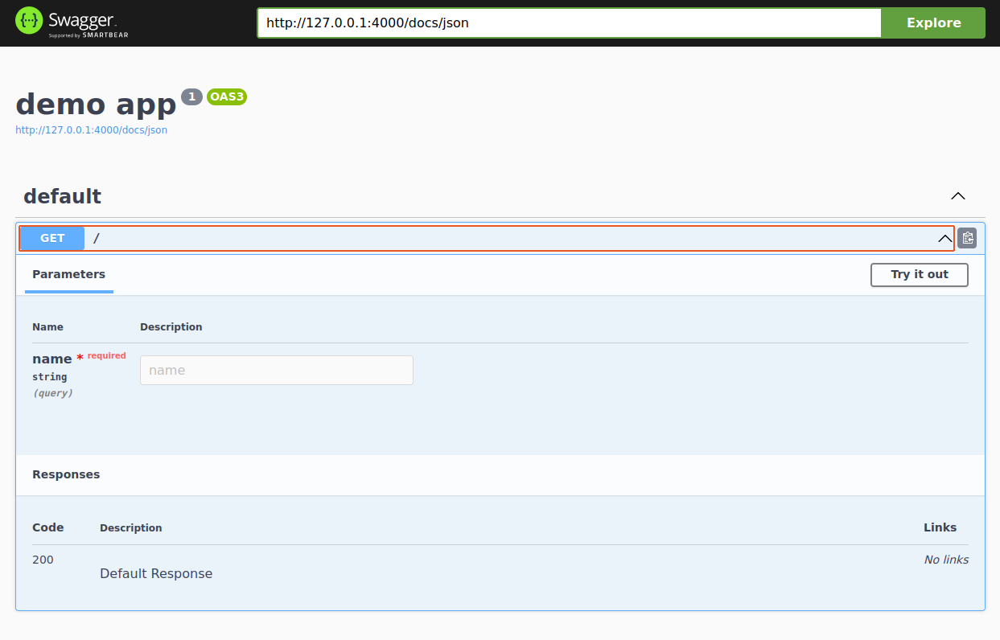

# First Steps

## Typescript

- Create a new npm project, install fastify, typescript, node.js types and nodemon with ts-node to create development server with auto restarting.

```bash
npm init -y
npm i fastify
npm i -D typescript @types/node nodemon ts-node
```

- Add the following commands to the "scripts" section of the package.json:

```json title="package.json"
{
  ...
  "scripts": {
    "build": "tsc -p tsconfig.json",
    "start": "node index.js",
    "dev": "nodemon index.ts"
  }
  ...
}
```

- Initialize a TypeScript configuration file:

```bash
npx tsc --init
```

- Copy that to a file index.ts.

```ts title="index.ts"
import fastify from "fastify";

const app = fastify();

app.get("/", (request, response) => {
  return "hello world";
});

app.listen({ port: 4000 }, (error, address) => {
  if (error) {
    console.error(error);
    process.exit(1);
  }
  console.log(`Server listening at ${address}`);
});
```

- Run command below to start the Fastify server

```bash
npm run dev
```

:::info
When you change your code the server will automatically restart.
:::

- Open your browser at [http://localhost:4000/](http://localhost:4000/)

## Validation

```ts title="index.ts"
...
app.get("/", (request, response) => {
  return `hello ${request.query.name}`;
});
...
```

:::danger
typescript error: 'request.query' is of type 'unknown'.
:::

:::info
This need a validation to be sure a user provide data that you want
:::

install typebox and typebox type provider

```bash
npm i @sinclair/typebox @fastify/type-provider-typebox
```

```ts title="index.ts"
import fastify from "fastify";
// import typebox and type provider
import { Type } from "@sinclair/typebox";
import { TypeBoxTypeProvider } from "@fastify/type-provider-typebox";

// apply type provider
const app = fastify().withTypeProvider<TypeBoxTypeProvider>();

app.get(
  "/",
  {
    schema: {
      // validate query string using typebox to create json schema
      querystring: Type.Object({
        name: Type.String(),
      }),
    },
  },
  (request, response) => {
    // typescript - name: string
    return `hello ${request.query.name}`;
  }
);

app.listen({ port: 4000 }, (error, address) => {
  if (error) {
    console.error(error);
    process.exit(1);
  }
  console.log(`Server listening at ${address}`);
});
```

- Open your browser at [http://localhost:4000/](http://localhost:4000/)
- Open your browser at [http://localhost:4000?name=jan](http://localhost:4000?name=jan)

## API Documentation

install @fastify/swagger and @fastify/swagger-ui wchich are nesseray to create interactive api documentation

```bash
npm i @fastify/swagger @fastify/swagger-ui
```

Update tsconfig and package.json with following properties

```json title="tsconfig.json"
{
  "compilerOptions": {
    ...
    "target": "ES2022",
    "module": "ES2022",
    ...
  }
  "ts-node": { "esm": true }
}
```

```json title="package.json"
{
  ...
  "type": "module",
  ...
}
```

:::info
make sure you have node version 16 or higher

```bash
node -v
```

:::

update code

```ts
import fastify from "fastify";
import { Type } from "@sinclair/typebox";
import { TypeBoxTypeProvider } from "@fastify/type-provider-typebox";
import fastifySwagger from "@fastify/swagger";
import fastifySwaggerUi from "@fastify/swagger-ui";

const app = fastify().withTypeProvider<TypeBoxTypeProvider>();

// highlight-start

await app.register(fastifySwagger, {
  openapi: {
    info: {
      title: "demo app",
      version: "1",
    },
  },
});

await app.register(fastifySwaggerUi, {
  routePrefix: "/docs",
});

// highlight-end

app.get(
  "/",
  {
    schema: {
      querystring: Type.Object({
        name: Type.String(),
      }),
    },
  },
  (request, response) => {
    return `hello ${request.query.name}`;
  }
);

app.listen({ port: 4000 }, async (error, address) => {
  if (error) {
    console.error(error);
    process.exit(1);
  }

  console.log(`Server listening at ${address}`);
});
```

- Open your browser at [http://localhost:4000/docs](http://localhost:4000/docs)
  

#### typesafe reponse

```ts
...
app.get(
  "/",
  {
    schema: {
      querystring: Type.Object({
        name: Type.String(),
      }),
    },
    // highlight-start

    response: {
      "200": Type.String()
    }

    // highlight-end
  },
  (request, response) => {
    return `hello ${request.query.name}`;
  }
);
...
```
